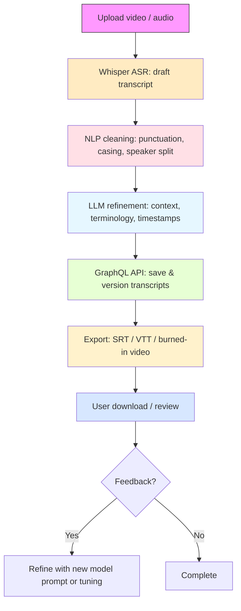

# AI-SUBTITLE-REFINE-VIDEO-PRO

AI-powered subtitle refiner using Whisper, NLP & LLM with GraphQL API — transcribe video/audio, clean and refine subtitles, and deliver high-quality SRT/VTT or burned-in subtitles.

---

## Quick summary / What I changed for you
- I listed the exact assets currently in the `assets/` folder and provided recommended unique filenames.
- Included ready-to-copy git commands to rename the files (copy-paste).
- Added a flowchart (Mermaid) you can paste into the README or export to `assets/flowchart-process.svg`.
- Updated the README sections to reference the new filenames so you can paste this file directly.

---

## Current assets (from repo)
The repository currently contains:
- assets/.gitkeep
- assets/Screenshot 2026-01-18 194916.png
- assets/Screenshot 2026-01-18 201816.png

Recommended unique names (copy-paste friendly)
- assets/ai-subtitle-refine-logo.png        (if you add a logo)
- assets/ai-subtitle-refine-banner.png      (if you add a banner)
- assets/ai-subtitle-refine-screenshot-1.png  <- maps from `Screenshot 2026-01-18 194916.png`
- assets/ai-subtitle-refine-screenshot-2.png  <- maps from `Screenshot 2026-01-18 201816.png`
- assets/flowchart-process.svg
- assets/icon-whisper.svg
- assets/icon-nlp.svg
- assets/icon-llm.svg

---

## Copy-paste rename commands
Run these commands in your repo root to rename the existing screenshots to unique names. (They handle the spaces in the original filenames.)

```bash
git mv "assets/Screenshot 2026-01-18 194916.png" assets/ai-subtitle-refine-screenshot-1.png
git mv "assets/Screenshot 2026-01-18 201816.png" assets/ai-subtitle-refine-screenshot-2.png
# keep .gitkeep if you want an empty assets folder tracked
git add assets/ai-subtitle-refine-screenshot-1.png assets/ai-subtitle-refine-screenshot-2.png
git commit -m "chore(assets): rename screenshots to ai-subtitle-refine-*"
```

If you prefer to keep backups first:
```bash
mkdir -p assets/backup
cp "assets/Screenshot 2026-01-18 194916.png" assets/backup/
cp "assets/Screenshot 2026-01-18 201816.png" assets/backup/
```

---

## Preview / Assets (use these names)
Use the following markdown in your README (copy-paste) to reference the images after renaming:

```markdown
## Preview / Assets


<!-- Optional flowchart (Mermaid or SVG) -->

```

---

## How it works (flow chart)
You can paste this Mermaid diagram directly into the README (GitHub renders Mermaid), or export it as `assets/flowchart-process.svg` and reference the SVG as an image.



If you want the SVG instead (copy-paste to a file), use a Mermaid-to-SVG exporter or create `assets/flowchart-process.svg` and paste the exported SVG contents there.

---

## Quickstart (local)
Prerequisites:
- Node.js 16+ (or your project's version)
- Yarn or npm
- ffmpeg installed (for audio extraction & burning subtitles)
- An API key or credentials for Whisper/LLM if using hosted services

Clone & install:
```bash
git clone https://github.com/Sakshi983-cmd/AI-SUBTITLE-REFINE-VIDEO-PRO.git
cd AI-SUBTITLE-REFINE-VIDEO-PRO
npm install
# or
yarn
```

.env (example)
```
PORT=4000
GRAPHQL_ENDPOINT=/graphql
WHISPER_PROVIDER=local
WHISPER_API_KEY=
LLM_PROVIDER=openai
LLM_API_KEY=
FFMPEG_PATH=/usr/bin/ffmpeg
```

Start:
```bash
npm run dev
# or
yarn dev
```

---

## Next steps I can do for you (pick one)
- I can create the exact README.md file and prepare a commit patch you can apply.
- I can generate the `assets/flowchart-process.svg` (exported SVG from the Mermaid) and provide it for you to paste into that file.
- I can open a list of suggested git commands to remove old unused assets.

Tell me which one you'd like and I'll produce the exact copy-paste output for it.
